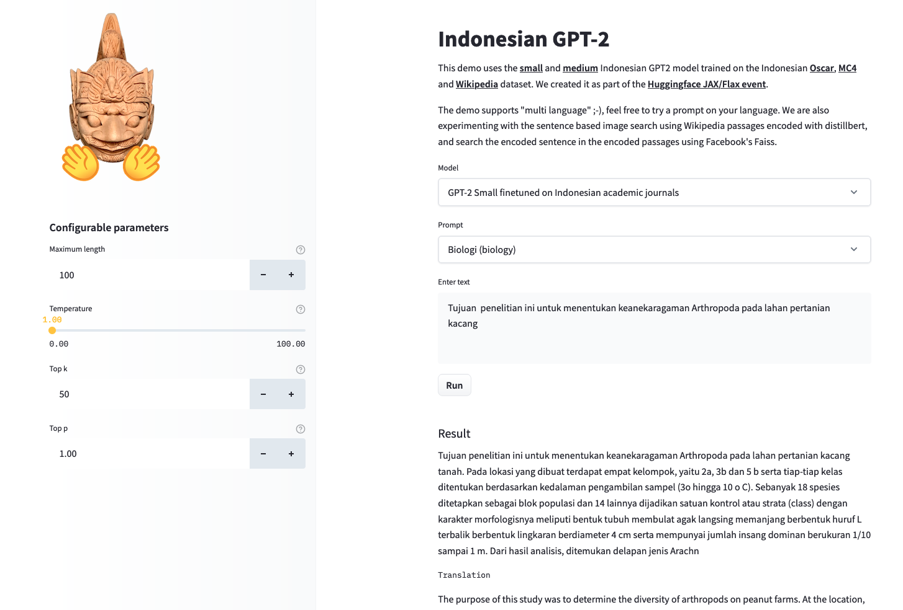

# Indonesian GPT-2 finetuned on Indonesian academic journals
This is the [Indonesian gpt2-small model](https://huggingface.co/flax-community/gpt2-small-indonesian) fine-tuned to abstracts of Indonesian academic journals. All training was done on a TPUv2-8 VM sponsored by [TPU Research Cloud](https://sites.research.google/trc/).

The demo can be found [here](https://huggingface.co/spaces/flax-community/gpt2-indonesian).



More details can be found [here](https://huggingface.co/Galuh/id-journal-gpt2).

## How to use
You can use this model directly with a pipeline for text generation. Since the generation relies on some randomness, 
we set a seed for reproducibility:
```python
>>> from transformers import pipeline, set_seed
>>> generator = pipeline('text-generation', model='Galuh/id-journal-gpt2')
>>> set_seed(42)
>>> generator("Sewindu sudah kita tak berjumpa,", max_length=30, num_return_sequences=5)

[{'generated_text': 'Penelitian ini menggunakan teknik DNA barcoding untuk mendeteksi perubahan genetik bakteri pada udang windu. Empat tahap telah dilakukan, meliputi preparasi media untuk larva,'},
 {'generated_text': 'Penelitian ini menggunakan teknik DNA barcoding untuk identifikasi gen pengasil flavonoid.  Data yang diperoleh dari hasil PCR diidentifikasi dengan teknik sekuensing'},
 {'generated_text': 'Penelitian ini menggunakan teknik DNA barcoding untuk mengekstraksi fragmen DNA dari sampel kulit buaya dan tulang anjing, di mana proses ini melibatkan karakterisasi enzim yang'},
 {'generated_text': 'Penelitian ini menggunakan teknik DNA barcoding untuk melakukan transformasi. Tahapan transformasi meliputi seleksi sel dengan urutan (2, 8, 16,..., 18) dan'},
 {'generated_text': 'Penelitian ini menggunakan teknik DNA barcoding untuk amplifikasi genom DNA dengan menggunakan primer TG8226 dan TG806. Metode pol'}]
```

Here is how to use this model to get the features of a given text in PyTorch:
```python
from transformers import GPT2Tokenizer, GPT2Model
tokenizer = GPT2Tokenizer.from_pretrained('Galuh/id-journal-gpt2')
model = GPT2Model.from_pretrained('Galuh/id-journal-gpt2')
text = "Ubah dengan teks apa saja."
encoded_input = tokenizer(text, return_tensors='pt')
output = model(**encoded_input)
```

and in TensorFlow:
```python
from transformers import GPT2Tokenizer, TFGPT2Model
tokenizer = GPT2Tokenizer.from_pretrained('Galuh/id-journal-gpt2')
model = TFGPT2Model.from_pretrained('Galuh/id-journal-gpt2')
text = "Ubah dengan teks apa saja."
encoded_input = tokenizer(text, return_tensors='tf')
output = model(encoded_input)
```

## Limitations and bias  
This model is originally the [Indonesian gpt2-small model](https://huggingface.co/flax-community/gpt2-small-indonesian), thus this model is also subject to the same [limitations and bias as the original model](https://huggingface.co/flax-community/gpt2-small-indonesian#limitations-and-bias). More detailed bias and analysis on this specific model is coming soon.

## Training data
The model was trained on a dataset of Indonesian journals. We only trained this model on the abstracts. We extract the abstract by writing a script to find any text that is located between the word "Abstrak" (abstract) and "Kata kunci" (keywords). The extraction script can be found [here](https://github.com/galuhsahid/id-journal-gpt2/). To separate each abstract, we also add an end of text token (`<|endoftext|>`) between each abstract.

The information of the sub-dataset and the distribution of the training and evaluation dataset are as follows:

| split | count | percentage |
| ---------- | ---------- | -------------- |
| train    | 146,248      | 90%         |
| validation    | 16,250      | 10%         |

## Training procedure 
The model was trained on a TPUv2-8 VM provided by [TPU Research Cloud](https://sites.research.google/trc/). The training duration was `2h 30m 57s`.

### Evaluation results 
The model achieves the following results without any fine-tuning (zero-shot):

| dataset | train loss | eval loss | eval perplexity |
| ---------- | ---------- | -------------- | ---------- |
| Indonesian journals dataset (abstract only)    | 2.913      | 2.855         | 17.37   |

### Tracking
The training process was tracked in [TensorBoard](https://huggingface.co/Galuh/id-journal-gpt2/tensorboard).

## How to run
Edit the hyperparameters and file paths in the `run_finetuning.sh` file.

After that, run the following command:

```bash
./run_finetuning.sh
```

### Pushing to HuggingFace Hub
Run the following commands:

```bash
transformers-cli login
```

This will prevent HuggingFace for asking for credentials every push:

```bash
git config --global credential.helper store
```
